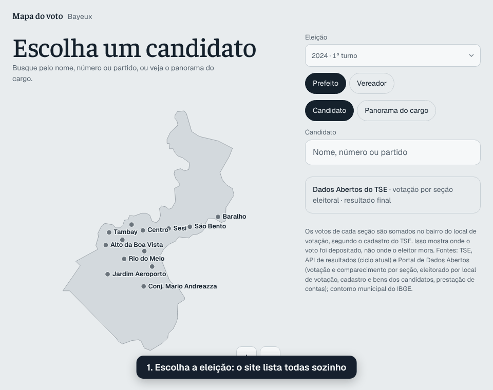
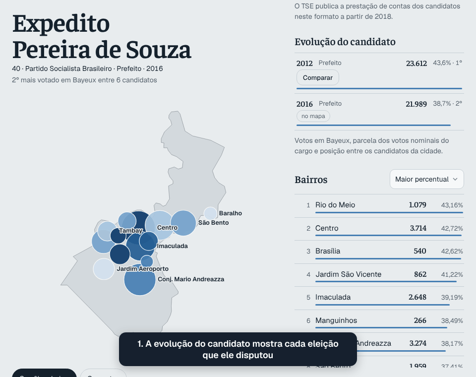
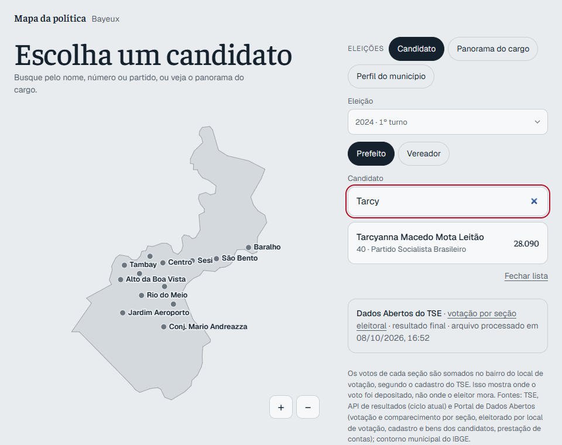
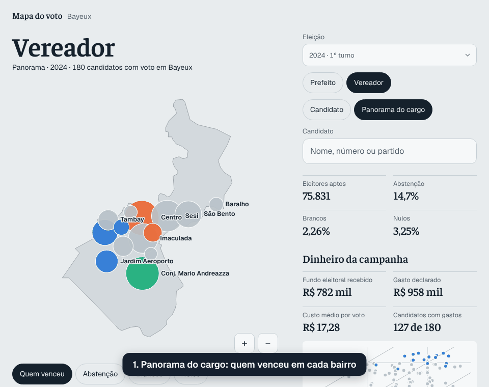

Site: https://calixtoneto.github.io/mapa-do-voto-bayeux/

# Mapa do voto · Bayeux

Votos de candidatos a prefeito, vereador, deputado federal, deputado estadual, senador e governador em cada bairro de Bayeux (PB), a partir dos resultados oficiais do TSE.

## Como usar



Abra o site: ele lista todas as eleições disponíveis sozinho, sem precisar baixar nem enviar arquivos. Escolha a eleição (ano e turno), o cargo e o candidato. Clique num bairro para ver os votos em cada escola.

O partido vem dos votos de legenda do arquivo por seção e pode faltar quando o partido não teve voto de legenda em Bayeux. Presidente não aparece: os bairros dependem de votos por seção, e o TSE publica o presidente em arquivo separado, só por município.

## Comparar a evolução de um candidato



Quando o candidato disputou mais de uma eleição, a seção **Evolução do candidato** mostra os votos dele em cada uma, com a parcela dos votos nominais e a posição. A ligação entre eleições é feita pelo nome completo no TSE, inclusive entre cargos diferentes (por exemplo, vereador em 2016 e deputado em 2018).

Clique em **Comparar** numa delas para ver no mapa onde o candidato ganhou e perdeu votos, com o ranking de variação e, no card, o "antes → depois". A cor mostra a variação dos votos (%) ou a da parcela (pontos percentuais).

O uso pensado é comparar **o mesmo cargo** (e o mesmo turno). É possível comparar cargos ou turnos diferentes, mas o botão traz "(outro cargo)" ou "(outro turno)" e o site mostra um aviso: mudam o tipo de disputa, o número de candidatos e os votos por eleitor (em anos de dois senadores, cada eleitor tem dois votos), então a variação não mede, por si só, crescimento ou queda de apoio.

## Análises

Além do mapa de votos, cada candidato e cada cargo têm análises tiradas dos Dados Abertos do TSE.

**Na ficha do candidato** (botão *Candidato*):



- **Dinheiro da campanha**: quanto recebeu, quanto declarou ter gasto, **custo por voto**, quanto veio do **fundo eleitoral** e a origem do dinheiro (fundo eleitoral, fundo partidário e partido, doações, recursos próprios e de outros candidatos); a **posição entre os candidatos do cargo** no recebido, no gasto e no fundo eleitoral, com a mediana do cargo; **para onde foi o dinheiro** (todas as categorias de despesa); **quem doou** (os dez maiores doadores, com a parcela de cada um no recebido) e **quem recebeu os pagamentos** (os dez maiores fornecedores); quanto **ficou sem pagar**, quanto veio do **maior doador** e de **recursos próprios**; **doadores e fornecedores em comum** com outras campanhas; **quando o dinheiro chegou** (por semana); e o dinheiro da mesma pessoa **em cada eleição** (recebido, gasto, votos e custo por voto).
- **Quem é**: gênero, cor ou raça, idade, escolaridade, ocupação, se tentou a reeleição, a situação final e o total de bens declarados.
- **Evolução patrimonial**: bens declarados em cada eleição, a variação entre elas (no total e por ano), **de que são os bens** (casa, veículos, aplicações…) e quanto o candidato pôs na própria campanha.
- **Força do voto**: nos cargos proporcionais, a parcela do **quociente eleitoral** e dos votos do partido, e a distância entre o eleito menos votado e o não eleito mais votado; os bairros **onde vai melhor** do que no conjunto; e o **perfil do eleitorado** (mulheres, jovens, idosos, escolaridade) dos bairros de onde vêm os votos.
- **Concentração do voto**: de quantos bairros veio metade dos votos e o número efetivo de bairros (voto de reduto ou espalhado).
- **Dobradinhas prováveis**: para cada outro cargo da mesma eleição (e, para senador, os outros senadores), os candidatos cuja votação sobe e desce nos mesmos bairros. Em cargos com poucos candidatos (governador, senador, prefeito) aparecem todos, inclusive os que andam ao contrário; nos outros, os cinco mais parecidos. Cada um traz a força da correlação (fraca, moderada ou forte).

**No panorama do cargo** (botão *Panorama do cargo*):



- Mapa de **quem venceu** em cada bairro e de **abstenção, brancos e nulos**, com os totais da cidade.
- **Gasto × votos** de todos os candidatos, com diagonais de custo por voto, e rankings de menor e maior custo por voto, mais fundo eleitoral, mais dinheiro recebido e maior gasto.
- **Fundo eleitoral por partido**, com a parcela para mulheres e para pessoas negras (pretas e pardas) e um aviso quando a parcela das mulheres fica abaixo de 30%.
- **Quem disputou e quem se elegeu**: gênero e cor ou raça de candidatos e eleitos.
- **Voto de reduto ou espalhado**: candidatos ordenados pela concentração do voto.
- **Maiores doadores** e **maiores fornecedores** dos candidatos do cargo, somados pelo CPF/CNPJ (que o site não mostra).
- **O dinheiro elege?**: gasto mediano de eleitos e não eleitos e a chance de se eleger em cada faixa de gasto.
- **Partidos**: votos, eleitos, gasto, custo por voto e fundo eleitoral de cada partido.
- **Concentração e reeleição**: parcela do fundo eleitoral que foi para os 10% que mais receberam, índice de Gini do fundo e quantos dos que tentaram se reeleger conseguiram.
- **Por bairro**: as disputas mais apertadas, onde o voto mais se dividiu ou se concentrou, as maiores altas e quedas da abstenção desde a eleição de 4 anos antes e o perfil do eleitorado de onde vêm os votos dos mais votados.

Cuidados que o site mostra junto dos números:

- **Gasto** é o total de despesas contratadas declaradas ao TSE, sem as doações a outras campanhas (que são gasto de quem recebe). **Custo por voto** é esse gasto dividido pelos votos do candidato em Bayeux.
- O **dinheiro de campanha** aparece só para prefeito e vereador: a campanha de deputado, senador ou governador é estadual e não dá para dividi-la pelos votos de Bayeux. O perfil e os bens aparecem para todos os cargos.
- O dinheiro que veio **de outros candidatos** fica separado, para não ser contado duas vezes (pode incluir fundo eleitoral repassado).
- A **prestação de contas é parcial** até o prazo da prestação final (cerca de 30 dias depois da eleição); o site avisa, e os números mudam quando o workflow roda de novo.
- O **fundo eleitoral** existe desde 2018 (nas eleições municipais, desde 2020), e a prestação de contas neste formato também. Para 2012, 2014 e 2016 o site diz que o dado não existe.
- A **regra dos 30% do fundo para mulheres** vale para o total nacional de cada partido; a parcela em Bayeux indica como o dinheiro foi distribuído na cidade, não uma irregularidade.
- **Dobradinhas** são candidatos cujas parcelas de voto sobem e descem nos mesmos bairros (correlação): votos no mesmo eleitorado, não prova de acordo político. Correlação negativa quer dizer que um vai melhor onde o outro vai pior; abaixo de 0,3 (em módulo) a relação é fraca.
- O **perfil do eleitorado** é o dos bairros de onde vêm os votos, ponderado pelos votos: descreve os lugares, não quem votou no candidato (o voto é secreto).
- O **quociente eleitoral** soma os votos de legenda quando o arquivo do TSE traz; senão, o site avisa que a conta é sem legenda. As vagas são os eleitos do cargo no cadastro do TSE.
- **Doadores e fornecedores em comum** mostram quem se liga a mais de uma campanha, não irregularidade nem acordo.
- **Bens** são valores nominais, sem correção pela inflação; a ligação entre eleições é pelo nome completo, como na evolução do candidato.
- No mapa de quem venceu, só os três candidatos que mais venceram têm cor própria; com mais cores elas deixam de ser distinguíveis, inclusive para daltônicos.

### De onde vêm as análises

O gerador `scripts/gerar-analises.mjs` grava, ao lado dos arquivos de votação:

| Arquivo | Fonte do TSE | Conteúdo |
|---|---|---|
| `ANO-candidatos.json` | Candidatos (`consulta_cand`) e bens (`bem_candidato`) | Perfil, total de bens e os maiores tipos de bem de cada candidato |
| `ANO-financas.json` | Prestação de contas dos candidatos (receitas, despesas contratadas e pagas) | Dinheiro por origem, gasto, repasses e maiores despesas de prefeitos e vereadores, e os maiores doadores; por candidato, os maiores doadores e fornecedores, o recebido por semana e o pago; a lista dos maiores doadores e fornecedores e de quem se liga a mais de um candidato |
| `ANO-tTURNO-comparecimento.json` | Detalhe da votação por seção | Aptos, comparecimento, brancos, nulos e (quando o TSE traz) votos de legenda por local de votação, cargo e turno (o site soma por bairro) |
| `ANO-eleitorado.json` | Perfil do eleitorado por seção (`perfil_eleitor_secao`) | Eleitores, mulheres, jovens, idosos e escolaridade por local de votação (o site soma por bairro) |
| `analises.json` | — | O que existe de cada ano (o site só pede os arquivos que existem) |
| `patrimonio.json` | — | Bens da mesma pessoa em cada eleição |
| `dinheiro.json` | — | Recebido, gasto e votos da mesma pessoa em cada eleição |

Para gerar ou atualizar: **Actions → Gerar análises → Run workflow** (em branco, refaz todos os anos; ou informe, por exemplo, `2020 2024`). O workflow **Atualizar dados de uma eleição** também gera as análises do ano. Localmente: `npm run analises -- 2024`.

## Perfis dos políticos

Em **Perfis** (ou direto em `#perfis`), quem governa Bayeux, com um endereço para cada perfil (`#perfil/prefeitura`, `#perfil/camara`, `#perfil/emendas`, `#perfil/cabo-rubem`…), bom para compartilhar:

- **Prefeitura**: o(a) prefeito(a) eleito(a), votos, remuneração na folha e os **credores do município ligados à campanha** (quem doou ou recebeu da campanha e depois recebeu do município). Para cada ano de 2017 em diante: quanto foi pago e **em que área**, por órgão, **quem mais recebeu**, quanto das **compras e serviços foi sem licitação**, a **folha** por tipo de cargo (efetivos, comissionados, contratados…), as **licitações** por modalidade e quem mais venceu, as **emendas que entraram no caixa** (União e Estado, individuais, de bancada e de comissão) e todos os doadores e fornecedores de campanhas municipais que receberam do município no ano.
- **Para onde foi o dinheiro**: em cada ano, uma árvore de decomposição que começa no total pago e se abre a cada toque até o fornecedor: **por área** (área → tipo de despesa → fornecedor), **por secretaria ou fundo** (o Fundo Municipal de Saúde, por exemplo), **pela origem do dinheiro** (recursos próprios, SUS, FUNDEB…) e só o **dinheiro de emendas** (origem da emenda → área → tipo de despesa → fornecedor), identificado pelo código de controle que o próprio Sagres põe em cada pagamento.
- **Gastos fora do padrão**: pagamentos sem licitação ou por dispensa que, somados no mesmo fornecedor e tipo de compra, passam do limite de dispensa por valor da Lei 14.133 (de 2024 em diante); meses com mais de 3 vezes o gasto de um mês típico; um fornecedor com 70% ou mais de um tipo de despesa de R$ 1 milhão ou mais; e tipos de compra que dobraram de um ano completo para o outro. **Não indicam irregularidade**: mostram onde vale olhar com mais cuidado, e a página diz isso antes da lista.
- **Vereadores**: partido e trocas de partido, mandato, **presença nas sessões**, **matérias de autoria** por tipo e as mais recentes (com link para o SAPL), **votos nominais** (sim, não, abstenção, quantas vezes votou com a maioria), **com quem mais e menos vota junto**, remuneração no mandato, votos na eleição (com link para o mapa) e os credores do município ligados à campanha.
- **Câmara Municipal**: sessões, votações nominais, presença de cada vereador, gasto e folha da Câmara em cada ano, em que gastou e quem mais recebeu.
- **Emendas para Bayeux**: quanto chegou ao Município, aos fundos municipais e às entidades da cidade, **quem mandou** (deputados, senadores, bancadas e comissões) e **quem recebeu**, por ano; e as emendas com Bayeux como destino, com os convênios assinados.

Leia assim:

- A ligação entre bases é **pelo nome completo** (o SAPL e a folha do TCE não trazem o CPF do vereador; o TCE não diz quem doou a campanhas): pode haver homônimos. Órgãos públicos (o próprio município, fundos, INSS) não entram nas ligações.
- **Sem licitação** é a parcela das compras, serviços, obras e locações pagas sem processo de licitação; dispensa e inexigibilidade aparecem à parte, nas licitações. Salário e previdência não entram na conta.
- Votos nominais só existem quando a Câmara registra o voto de cada vereador no SAPL; votações simbólicas só têm o resultado. **Votar junto** não prova acordo político.
- A presença conta as sessões com presença registrada no SAPL desde o início do mandato de cada um (a legislatura atual começou em 2025). Quem tem afastamento registrado, mas esteve em alguma das cinco últimas sessões, aparece em exercício.
- O prefeito de cada ano é o eleito na eleição anterior; mudanças no meio do mandato (cassação, renúncia, interinos) não aparecem.
- Os dados do ano corrente do TCE-PB são parciais (até o último mês enviado pela Prefeitura).
- Nos alertas só entram compras, serviços, obras e locações; energia, água, telefone, tarifas e a publicação de atos oficiais (fornecedor único) ficam de fora. A modalidade é a registrada pela Prefeitura no Sagres: um contrato licitado registrado como "sem licitação" aparece no alerta. Os limites de dispensa são os dos decretos 11.871/2023, 12.343/2024 e 12.807/2025; um ano novo usa o último até o decreto ser incluído em `scripts/perfis/alertas.mjs`.

## De onde vêm os dados

Os resultados ficam no repositório, em `public/data/eleicoes/`: um `ANO-tTURNO.json` por eleição e turno um `index.json` que o site lê para listar as eleições e um `pessoas.json` que liga o mesmo candidato entre eleições (pelo nome completo). A tabela de locais de votação de cada ano fica em `public/data/secoes-ANO.json`. O site é totalmente estático: o navegador do visitante nunca chama o TSE.

Os bairros precisam de votos por seção eleitoral, e a [API de resultados do TSE](https://resultados.tse.jus.br/) só entrega votos por município. Por isso o gerador (`scripts/gerar-dados.mjs`) usa, para cada ano:

1. **CSV por seção dos Dados Abertos do TSE**, que tem os bairros.
2. **API de resultados**, só se o CSV ainda não tiver sido publicado (comum logo depois de uma eleição). Nesse caso o site mostra só o total de Bayeux, com um aviso, até o CSV sair e os dados serem atualizados.

Eleições já geradas: 2012, 2014, 2016, 2018, 2020, 2022, 2024 e 2026.

Os perfis ficam em `public/data/perfis/` (`camara.json`, `emendas.json`, um `prefeitura-ANO.json` por ano e `index.json`), gerados por `scripts/gerar-perfis.mjs` a partir de três fontes, todas sem chave de acesso:

1. **TCE-PB (Sagres)**, [dados abertos por município](https://dados-abertos.tce.pb.gov.br/): despesas, servidores, receitas e licitações de Bayeux (município `025`), um .zip por ano.
2. **SAPL da Câmara Municipal** (`sapl.bayeux.pb.leg.br/api`): vereadores, mandatos, partidos, sessões, presença, votos nominais e matérias.
3. **Portal da Transparência (CGU)**: emendas parlamentares, convênios e favorecidos.

O workflow **Atualizar perfis** roda todo dia 10 e pode ser acionado à mão (Actions > Atualizar perfis > Run workflow).

## Nas próximas eleições

No GitHub, abra **Actions → Atualizar dados de uma eleição → Run workflow** e informe o ano. O workflow gera os arquivos, commita em `public/data/` e dispara a publicação do site. Rode de novo quando o CSV por seção sair, para trocar o total da cidade pelos bairros.

O mesmo pode ser feito localmente, e o workflow só repete esses passos:

```bash
npm install
npm run eleicoes -- 2030 --forcar   # gera public/data/eleicoes/2030-t*.json (e a tabela de locais do ano, se faltar)
git add public/data && git commit -m "dados: eleição 2030" && git push
```

## Como os votos chegam aos bairros

O TSE não publica votos por bairro. Cada seção eleitoral pertence a um local de votação (em geral uma escola), e a tabela "Eleitorado por local de votação" do TSE informa o bairro e as coordenadas de cada local. Os votos de cada seção são somados no bairro do local onde ela funciona.

Isso mostra **onde o voto foi depositado, não onde o eleitor mora**. O bairro vem do campo `NM_BAIRRO` do TSE, que às vezes difere do bairro citado no endereço.

## Desenvolvimento

```bash
npm install
npm run dados       # contorno (IBGE) e tabelas de locais de votação (TSE)
npm run eleicoes    # gera os anos que ainda não existem (use -- ANO para escolher; --forcar para refazer)
npm run dev         # http://localhost:5174
```

## Testes

```bash
npm test
```

Rodam offline, em menos de um segundo, sem baixar nada do TSE:

- `test/caracterizacao.test.mjs` é um *golden master*: monta 2024 (CSV por seção, com a tabela de locais) e 2026 (só a API) com os mesmos formatos do TSE (zips em `tmp/` e um `fetch` falso), roda os geradores inteiros e compara a saída com `test/fixtures/esperado/`. Se uma mudança na saída for intencional, regrave com `ATUALIZAR_ESPERADO=1 npm test` e revise o diff dos arquivos esperados.
- `test/unidade/` testa cada regra isolada: divisão do CSV, branco, nulo e legenda, nome do partido, seção fora da tabela, grafias do mesmo bairro, coordenadas com vírgula ou fora do município e o que é pedido à API.

## Organização dos geradores

| Pasta | O que tem |
|---|---|
| `scripts/gerar-dados.mjs` | Linha de comando dos votos: escolhe os anos e encadeia as etapas |
| `scripts/gerar-secoes.mjs` | Linha de comando da tabela seção → local de votação → bairro |
| `scripts/gerar-analises.mjs` | Linha de comando das análises: cadastro, bens, prestação de contas e comparecimento |
| `scripts/gerar-perfis.mjs` | Linha de comando dos perfis: Prefeitura e Câmara (TCE-PB), vereadores (SAPL) e emendas (Portal da Transparência) |
| `scripts/perfis/` | Regras dos perfis: despesas, folha, receitas, licitações, presença, votos, matérias, emendas e cruzamentos pelo nome |
| `scripts/eleicao/` | Configuração (município, cargos) e a apuração (soma de votos por local) |
| `scripts/fontes/` | CSV por seção, API de resultados e leitura da tabela de seções |
| `scripts/secoes/` | Bairros, coordenadas e montagem da tabela de seções |
| `scripts/analises/` | Regras das análises: classificação do dinheiro, perfil, comparecimento, patrimônio e o escopo do site |
| `scripts/saida/` | `pessoas.json`, `index.json`, arquivos das análises e escrita |
| `scripts/lib/` | CSV do TSE, texto e acesso à rede (retentativa, cache em disco, leitura de .zip) |

Cada fonte separa o tratamento de uma linha (função pura, testada sem .zip) da leitura do arquivo.

## Stack

Preact + htm, Canvas 2D, SVG (gráfico gasto × votos) e módulos ES nativos para as análises (`public/js/*.mjs`) e os perfis (`public/js/perfil/`). fflate só nos scripts. Sem etapa de build: a pasta `public/` é o site.

## Fontes

- TSE: Portal de Dados Abertos (votação por seção, detalhe da votação por seção, eleitorado por local de votação, candidatos, bens de candidatos e prestação de contas eleitorais) e API de resultados.
- Contorno municipal: IBGE, API de malhas.
- Perfis: TCE-PB (Sagres, dados abertos por município), SAPL da Câmara Municipal de Bayeux e Portal da Transparência (emendas parlamentares).
